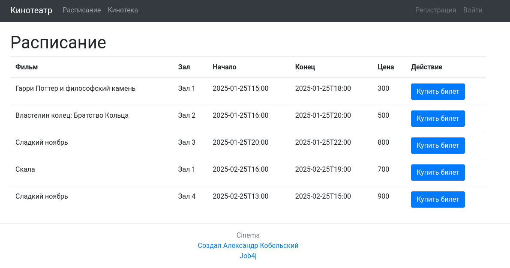

# Сервис - Кинотеатр

## Описание проекта

job4j_cinema - сервис по покупке билетов в кинотеатр.
Сервис позволяет:
1. Зарегистрировать нового пользователя или войти в систему при наличии аккаунта.
2. Посмотреть информацию о киносеансах и фильмах
3. Купить билет.

Данные сохраняются в БД.

### Технологии используемые в проекте:
- Spring boot
- Tomcat
- Thymeleaf
- Bootstrap
- Liquibase
- PostgreSQL
- H2
- Sql2o
- Junit5
- AssertJ
- Mockito

# Запуск

1. Создайте Postgres базу данных "cinema" 
```
CREATE DATABASE cinema
```

2. Клонируйте репозиторий
```
git clone https://github.com/hrodvar-one/job4j_cinema
```

3. Переходим в папку куда склонировали проект
```
cd job4j_cinema
```

4. Соберите проект с помощью Maven под профилем "production":
```
mvn clean install -Pproduction
```

5. Запустите приложение:
```
mvn spring-boot:run
```
После запуска, проект будет доступен по адресу: [http://localhost:8080](http://localhost:8080)

Взаимодействие с приложением:

1. Главная


2. Расписание



3. Кинотека


4. Страница входа


5. Страница регистрации


6. Страница покупки билета


7. Страница успешной покупки билета


8. Страница неуспешной покупки билета


## Контакты

Telegram: @hrodvar